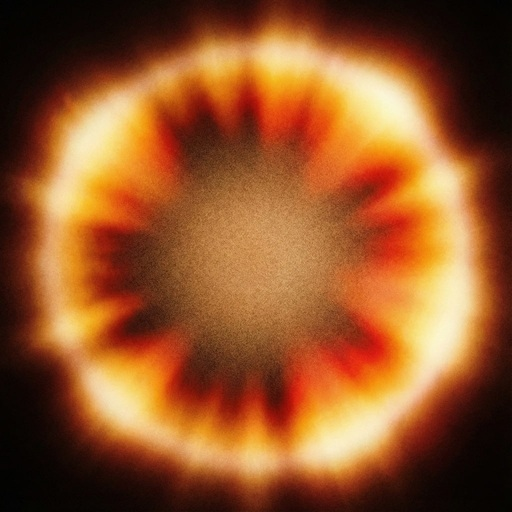
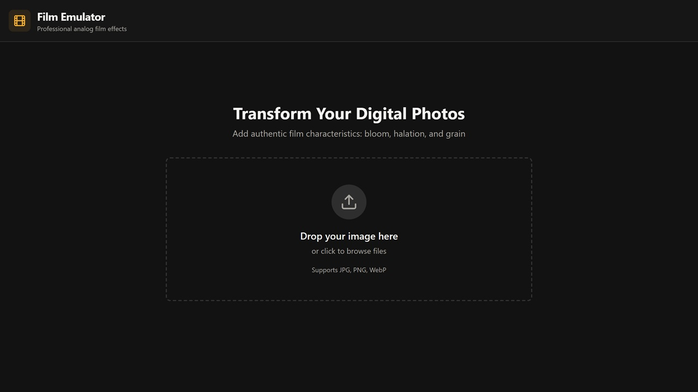
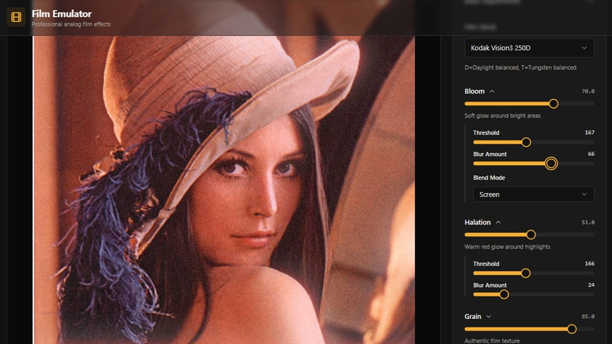

# Film Glow Studio

<div align="center">
  
</div>

A web app that adds analog film effects to your digital photos.

## Quick Start

### A) Local Deploy

```sh
docker pull ghcr.io/flapenta/filmglowstudio:latest
docker run -p 8080:80 ghcr.io/flapenta/filmglowstudio:latest
```

Open http://localhost:8080 in your browser.

### B) Deploy on Vercel

[](https://vercel.com/new/clone?repository-url=https%3A%2F%2Fgithub.com%2Flapentad%2FFilmGlowStudio)

## What it does

- **Film emulation**: Kodak Vision3 and Fujifilm looks
- **Halation**: Red glow around bright areas (like real film)
- **Bloom**: Soft white glow effect
- **Film grain**: Adjustable texture and intensity
- **Color tools**: Temperature, contrast, shadows, highlights, saturation, vibrance
- **Extra effects**: Vignette, sharpness, softness

<div align="left">
  
</div>

<div align="left">
  
</div>


## Built with

- React + TypeScript
- Vite
- Photon (WebAssembly for fast image processing)
- shadcn-ui + Tailwind CSS

## Development

```sh
# Install dependencies
npm install

# Start dev server
npm run dev

# Build for production
npm run build
```

## Docker

### Using Docker Compose

```sh
docker compose up -d
```

### Manual Docker

```sh
# Build image
docker build -t filmglowstudio .

# Run container
docker run -p 8080:80 filmglowstudio
```

